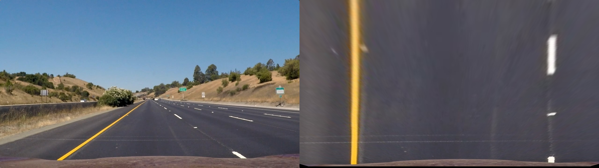

# Writeup
[](http://www.udacity.com/drive)

## Advanced Lane Finding Project

The goals / steps of this project are the following:

* Compute the camera calibration matrix and distortion coefficients given a set of chessboard images.
* Apply a distortion correction to raw images.
* Use color transforms, gradients, etc., to create a thresholded binary image.
* Apply a perspective transform to rectify binary image ("birds-eye view").
* Detect lane pixels and fit to find the lane boundary.
* Determine the curvature of the lane and vehicle position with respect to center.
* Warp the detected lane boundaries back onto the original image.
* Output visual display of the lane boundaries and numerical estimation of lane curvature and vehicle position.

## Results
### Video Implementation

| [](https://www.youtube.com/watch?v=8ZEDhTgOIWw "Project video") | [](https://www.youtube.com/watch?v=Bf9iDc1qJ2M "Challenge video") | [](https://www.youtube.com/watch?v=_bUIVBDhzPg "Harder challenge video") |
|:--:|:--:|:--:|
| *Project Video* | *Challenge Video* | *Harder Challenge Video* |

As expected, the simplistic algorithm cannot keep up with the changes in lighting and color intensity. A Deep Learning based image segmentation pipeline will do a much better job at identifying the patch of road.

### Camera Calibration

#### 1. Briefly state how you computed the camera matrix and distortion coefficients. Provide an example of a distortion corrected calibration image.

The code for this step is contained in the first code cell of the IPython notebook located in "./camera_calibration.ipynb".  

I start by preparing "object points", which will be the (x, y, z) coordinates of the chessboard corners in the world. Here I am assuming the chessboard is fixed on the (x, y) plane at z=0, such that the object points are the same for each calibration image.  Thus, `objp` is just a replicated array of coordinates, and `objpoints` will be appended with a copy of it every time I successfully detect all chessboard corners in a test image.  `imgpoints` will be appended with the (x, y) pixel position of each of the corners in the image plane with each successful chessboard detection.  

I then used the output `objpoints` and `imgpoints` to compute the camera calibration and distortion coefficients using the `cv2.calibrateCamera()` function.  I applied this distortion correction to the test image using the `cv2.undistort()` function and obtained this result: 

|  | 
|:--:| 
| *Calibration example 1* |

|  | 
|:--:| 
| *Calibration example 2* |


#### 2. Describe how (and identify where in your code) you performed a perspective transform and provide an example of a transformed image.

The code for my perspective transform includes a function called `warp()`, which appears in lines 115 through 118 in the file `util.py`. The function takes as inputs an image (`img`), as well as a pre-computed perspective transform matrix `M`. I chose the hardcode the source and destination points in the following manner in the notebook `main.ipynb`:

```python
# Create perspective and inverse persepective transform matrices
src = np.float32([[230, 702], [557, 477], [726, 477], [1075, 702]])
dst = np.float32([[230, 702], [230, 0], [1075, 0], [1075, 702]])
M = cv2.getPerspectiveTransform(src, dst)
Minv = cv2.getPerspectiveTransform(dst, src)
```

I verified that my perspective transform was working as expected by drawing the `src` and `dst` points onto a test image and its warped counterpart to verify that the lines appear parallel in the warped image.

|  | 
|:--:| 
| *Perspective transform* |

### Pipeline

#### 1. Provide an example of a distortion-corrected image.

To demonstrate this step, I will describe how I apply the distortion correction to one of the test images like this one:

|  | 
|:--:| 
| *Undistortion example* |

It may be difficulto to notice the distortion effect in the original image, please look at the hood of the car popping out in the right bottom corner to spot the difference.


#### 2. Describe how (and identify where in your code) you used color transforms, gradients or other methods to create a thresholded binary image.  Provide an example of a binary image result.

I used a combination of color and gradient thresholds to generate a binary image (thresholding steps at lines 23 through 69 in `util.py`).  Here's an example of my output for this step.

|  | 
|:--:| 
| *Gradient thresholding* |

|  | 
|:--:| 
| *Gradient + yellow color thresholding* |

|  | 
|:--:| 
| *Gradient + white color thresholding* |

#### 3. Describe how (and identify where in your code) you identified lane-line pixels and fit their positions with a polynomial?

Then I implemented sliding window algorithm as described in the tutorials and fit my lane lines with a 2nd order polynomial kinda like this:

|  | 
|:--:| 
| *Curve fitting* |

The code is contained in the `Lane` class in `util.py` file. I keep track of fitted coefficients frame to frame for each of the left and right lines. The lines are changes only if

1. There were enough points found inside a fixed margin (of width `100` pixels) around previously fitted lines.
2. If points are found interspersed throughout the y-axis direction (that is, a line is not fitted if only one blob points was found in the frame somewhere in the middle).

If following conditions are not met, then lines from previous frame are used.

#### 4. Describe how (and identify where in your code) you calculated the radius of curvature of the lane and the position of the vehicle with respect to center.

Two functions named `find_curvature` and `find_offset` of `Lane` class in `util.py` do this. I pretty much used the code presented in the tutorials.

#### 5. Provide an example image of your result plotted back down onto the road such that the lane area is identified clearly.

This is done in `process_image` function in `main.ipynb` notebook. This is the main function that processes each frame of the video. Again, I pretty much used the code presented in the tutorial to achieve this.

|  | 
|:--:| 
| *Lane detection* |

## Discussion
I foresee (also as can be seen in other two challenge videos):

1. There is a lot of scope left for tinkering and making robust gradient and color based thresholding of the image. Instead of a single rule, it would make sense to have several rules (or features) to identify different colors under different conditions and see which one is applicable in the given case. The shadow of the bridge in the first challenge video and constantly differing lighting conditions in the second, harder challege video completely throw my lane detection off.
2. I could perhaps also improve the line detection by a implementing a combination of the following factors:
	1. Maintaining a history of line detections from previous frames and using some sort of smoothing technique to prevent wobbly detection of lines
	2. If one line has been detected with higher confidence than the other, then using the higher confidence one to adjust the curvature of the second line (this is possible to do because lines are generally parallel and of fixed width).
	3. This is outside the scope of this project, but tracking actions of other vehicles to better estimate your lane.