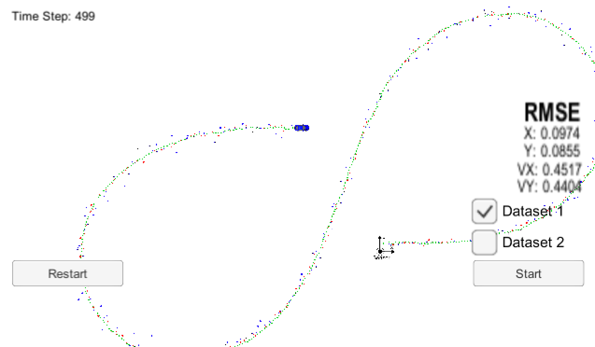

# Writeup
[](http://www.udacity.com/drive)

## Extended Kalman Filter Project

The goals of this project are:

1. Design an Extended Kalman Filter algorithm to locate a vehicle in a simulated environment.
2. The vehicle will run against a test data. The algorithm should handle inputs from multiple sensors, in this case a RADAR and LiDAR.
3. The algorithm's output will be compared to known ground truth and RMSE value should be below a reasonable, known upper bound.

### Result
| [](https://www.youtube.com/watch?v=K8vDUGGH1_o "Output video") |
|:--:|
| *Project Video* |

### Accuracy
RMSE for `x`, `y`, `vx`, `vy` is lower than the corresponding upper bounds of `[.11, .11, 0.52, 0.52]`.



### Correct Algorithm
Prediction and measurement update logic is clearly outlined in [kalman_filter.cpp](src/kalman_filter.cpp). There are two different update functions - one for Linear Kalman Filter and another for Extended Kalman Filter. Thus the filter can accommodate both laser and radar measurements.

The first measurement, whether it is from laser or radar is used to initialize the filter state variable.

### Code Efficiency
The code in [kalman_filter.cpp](src/kalman_filter.cpp) computes the residual, both in the linear and non-linear case and then updates the state and uncertainty variables using the residual vector and the Kalman gain matrix.

## Build Instructions

This project involves the Term 2 Simulator which can be downloaded [here](https://github.com/udacity/self-driving-car-sim/releases)

This repository includes two files that can be used to set up and install [uWebSocketIO](https://github.com/uWebSockets/uWebSockets) for either Linux or Mac systems. For windows you can use either Docker, VMware, or even [Windows 10 Bash on Ubuntu](https://www.howtogeek.com/249966/how-to-install-and-use-the-linux-bash-shell-on-windows-10/) to install uWebSocketIO. Please see [this concept in the classroom](https://classroom.udacity.com/nanodegrees/nd013/parts/40f38239-66b6-46ec-ae68-03afd8a601c8/modules/0949fca6-b379-42af-a919-ee50aa304e6a/lessons/f758c44c-5e40-4e01-93b5-1a82aa4e044f/concepts/16cf4a78-4fc7-49e1-8621-3450ca938b77) for the required version and installation scripts.

Once the install for uWebSocketIO is complete, the main program can be built and run by doing the following from the project top directory.

```
1. mkdir build
2. cd build
3. cmake ..
4. make
5. ./ExtendedKF
```

Tips for setting up your environment can be found [here](https://classroom.udacity.com/nanodegrees/nd013/parts/40f38239-66b6-46ec-ae68-03afd8a601c8/modules/0949fca6-b379-42af-a919-ee50aa304e6a/lessons/f758c44c-5e40-4e01-93b5-1a82aa4e044f/concepts/23d376c7-0195-4276-bdf0-e02f1f3c665d)

Note that the programs that need to be written to accomplish the project are [FusionEKF.cpp](src/FusionEKF.cpp), [FusionEKF.h](src/FusionEKF.h), [kalman_filter.cpp](src/kalman_filter.cpp), [kalman_filter.h](src/kalman_filter.h), [tools.cpp](src/tools.cpp), and [tools.h](src/tools.h)

The program `main.cpp` has already been filled out.

Here is the main protcol that `main.cpp` uses for `uWebSocketIO` in communicating with the simulator.


INPUT: values provided by the simulator to the c++ program

`["sensor_measurement"]` => the measurement that the simulator observed (either lidar or radar)


OUTPUT: values provided by the c++ program to the simulator

`["estimate_x"]` <= kalman filter estimated position x
`["estimate_y"]` <= kalman filter estimated position y
`["rmse_x"]`
`["rmse_y"]`
`["rmse_vx"]`
`["rmse_vy"]`

---

## Other Important Dependencies

* cmake >= 3.5
  * All OSes: [click here for installation instructions](https://cmake.org/install/)
* make >= 4.1 (Linux, Mac), 3.81 (Windows)
  * Linux: make is installed by default on most Linux distros
  * Mac: [install Xcode command line tools to get make](https://developer.apple.com/xcode/features/)
  * Windows: [Click here for installation instructions](http://gnuwin32.sourceforge.net/packages/make.htm)
* gcc/g++ >= 5.4
  * Linux: gcc / g++ is installed by default on most Linux distros
  * Mac: same deal as make - [install Xcode command line tools](https://developer.apple.com/xcode/features/)
  * Windows: recommend using [MinGW](http://www.mingw.org/)

## Basic Build Instructions

1. Clone this repo.
2. Make a build directory: `mkdir build && cd build`
3. Compile: `cmake .. && make` 
   * On windows, you may need to run: `cmake .. -G "Unix Makefiles" && make`
4. Run it: `./ExtendedKF `


