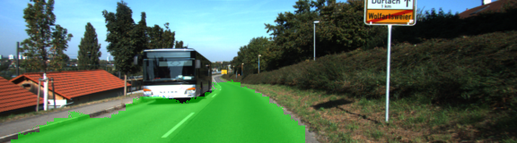

# Semantic Segmentation
### Introduction
In this project, we label the pixels of a road in images using a Fully Convolutional Network (FCN).

### Setup
##### GPU
`main.py` will check to make sure you are using GPU - if you don't have a GPU on your system, you can use AWS or another cloud computing platform.
##### Frameworks and Packages
Make sure you have the following is installed:
 - [Python 3](https://www.python.org/)
 - [TensorFlow](https://www.tensorflow.org/)
 - [NumPy](http://www.numpy.org/)
 - [SciPy](https://www.scipy.org/)
##### Dataset
Download the [Kitti Road dataset](http://www.cvlibs.net/datasets/kitti/eval_road.php) from [here](http://www.cvlibs.net/download.php?file=data_road.zip).  Extract the dataset in the `data` folder.  This will create the folder `data_road` with all the training a test images.

### Code
##### Implementation
The code in the `main.py` module trains a model based on the data downloaded in the `data` folder and runs the model on the test images.
##### Run
Run the following command to run the project:
```
python main.py
```
**Note** If running this in Jupyter Notebook system messages, such as those regarding test status, may appear in the terminal rather than the notebook.

### Model
The model is based on FCN-8 architecture described [here](https://arxiv.org/abs/1411.4038).
The model was replicated by looking at the code provided by the authors on [GitHub](https://github.com/shelhamer/fcn.berkeleyvision.org/blob/master/voc-fcn8s-atonce). The encoder part of the model is based on VGG-16 architecture and is frozen during training. Only decoder layers are trained.
 
### Result
##### Loss
Training the model on KITTI dataset for 20 epochs took ~10-15min of time on a NVidia Tital X (Pascal) GPU with 12GB of RAM.

The loss went down as follows:

```
Epoch:   0 Loss: 6.3983E-01
Epoch:   1 Loss: 4.3009E-01
Epoch:   2 Loss: 2.9034E-01
Epoch:   3 Loss: 2.3380E-01
Epoch:   4 Loss: 2.1056E-01
Epoch:   5 Loss: 1.9645E-01
Epoch:   6 Loss: 1.8708E-01
Epoch:   7 Loss: 1.7992E-01
Epoch:   8 Loss: 1.7388E-01
Epoch:   9 Loss: 1.6838E-01
Epoch:  10 Loss: 1.6340E-01
Epoch:  11 Loss: 1.5862E-01
Epoch:  12 Loss: 1.5447E-01
Epoch:  13 Loss: 1.5132E-01
Epoch:  14 Loss: 1.4740E-01
Epoch:  15 Loss: 1.4435E-01
Epoch:  16 Loss: 1.4205E-01
Epoch:  17 Loss: 1.3925E-01
Epoch:  18 Loss: 1.3744E-01
Epoch:  19 Loss: 1.3470E-01
```
The model does reasonably well without any data augmentation or end-to-end training. Following are some of the test images:





### Improvements
1. As is clear from the images above, the model suffers from the "Checkboard Artifact" effect of the transpose convolutional layers as illustrated [here](https://distill.pub/2016/deconv-checkerboard). Some of the solutions explained in the linked publication can be tried to get rid of them.
2. Efficient hyperparameter search - the model has a buch of hyperparameters such as the regularlization coefficients for the decoder layers, scaling factors for skip connections, batch size, learning rate, kernel sizes for transposed convolution layers, etc. I selected hyperparameters based on prior knowledge and through a trail and experiment basis.
3. One can be more intelligent in initializing kernels of transposed convolutions layers. I simply used Xavier initialization and it seemed to work fine. But, a few people have reported improvements by starting with kernels that do bilinear interpolation.
