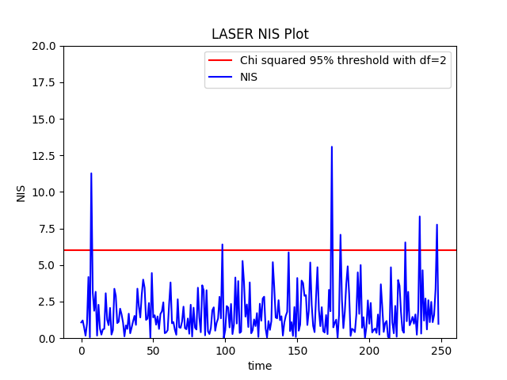

# Writeup
[](http://www.udacity.com/drive)

## Unscented Kalman Filter Project 

The goals of this project are:

1. Design an Extended Kalman Filter algorithm to locate a vehicle in a simulated environment.
2. The vehicle will run against a test data. The algorithm should handle inputs from multiple sensors, in this case a RADAR and LiDAR.
3. The algorithm's output will be compared to known ground truth and RMSE value should be below a reasonable, known upper bound.

## [Project](https://review.udacity.com/#!/projects/284/view) Rubric

In this project we utilize an Unscented Kalman Filter to estimate the state of a moving object of interest with noisy lidar and radar measurements.

### Result
| [](https://www.youtube.com/watch?v=s-IUKLa43UI "Output video") |
|:--:|
| *Project Video* |

### Accuracy
RMSE for x, y, vx, vy is lower than the corresponding upper bounds of [.09, .10, .40, .30].


Also, the NIS values for both the sensors seem to be within 95% bound for the corresponding chi squared distribution with appropriate degrees of freedom (3 for the radar and 2 for the laser).

Radar NIS                  |  Laser NIS
:-------------------------:|:-------------------------:
    |  

The values of standard deviations of process noise variables were adjusted intuitively by observing how fast vehicles move and turn in the real world. 

### Algorithm
Prediction and measurement update logic is clearly outlined in [ukf.cpp](src/ukf.cpp). There are two different update functions - one for Radar and another for Laser. Thus the filter can accommodate both laser and radar measurements.

The first measurement, whether it is from laser or radar is used to initialize the filter state variable.

### Code Efficiency
The code in [ukf.cpp](src/ukf.cpp) computes sensor specific transformation of sigma ponits from (augmented) state to the measurement space and then uses a (somewhat) sensor agnostic function `UpdateWithZSigPoints` to reduce code duplication.

## Build Instructions

This project involves the Term 2 Simulator which can be downloaded [here](https://github.com/udacity/self-driving-car-sim/releases)

This repository includes two files that can be used to set up and intall [uWebSocketIO](https://github.com/uWebSockets/uWebSockets) for either Linux or Mac systems. For windows you can use either Docker, VMware, or even [Windows 10 Bash on Ubuntu](https://www.howtogeek.com/249966/how-to-install-and-use-the-linux-bash-shell-on-windows-10/) to install uWebSocketIO. Please see [this concept in the classroom](https://classroom.udacity.com/nanodegrees/nd013/parts/40f38239-66b6-46ec-ae68-03afd8a601c8/modules/0949fca6-b379-42af-a919-ee50aa304e6a/lessons/f758c44c-5e40-4e01-93b5-1a82aa4e044f/concepts/16cf4a78-4fc7-49e1-8621-3450ca938b77) for the required version and installation scripts.

Once the install for uWebSocketIO is complete, the main program can be built and ran by doing the following from the project top directory.

```
1. mkdir build
2. cd build
3. cmake ..
4. make
5. ./UnscentedKF
```

Tips for setting up your environment can be found [here](https://classroom.udacity.com/nanodegrees/nd013/parts/40f38239-66b6-46ec-ae68-03afd8a601c8/modules/0949fca6-b379-42af-a919-ee50aa304e6a/lessons/f758c44c-5e40-4e01-93b5-1a82aa4e044f/concepts/23d376c7-0195-4276-bdf0-e02f1f3c665d)

Here is the main protcol that `main.cpp` uses for `uWebSocketIO` in communicating with the simulator.


INPUT: values provided by the simulator to the c++ program

`["sensor_measurement"]` => the measurment that the simulator observed (either lidar or radar)


OUTPUT: values provided by the c++ program to the simulator

`["estimate_x"]` <= kalman filter estimated position x
`["estimate_y"`] <= kalman filter estimated position y
`["rmse_x"]`
`["rmse_y"]`
`["rmse_vx"]`
`["rmse_vy"]`

---

## Other Important Dependencies
* cmake >= 3.5
  * All OSes: [click here for installation instructions](https://cmake.org/install/)
* make >= 4.1 (Linux, Mac), 3.81 (Windows)
  * Linux: make is installed by default on most Linux distros
  * Mac: [install Xcode command line tools to get make](https://developer.apple.com/xcode/features/)
  * Windows: [Click here for installation instructions](http://gnuwin32.sourceforge.net/packages/make.htm)
* gcc/g++ >= 5.4
  * Linux: gcc / g++ is installed by default on most Linux distros
  * Mac: same deal as make - [install Xcode command line tools](https://developer.apple.com/xcode/features/)
  * Windows: recommend using [MinGW](http://www.mingw.org/)

## Basic Build Instructions

1. Clone this repo.
2. Make a build directory: `mkdir build && cd build`
3. Compile: `cmake .. && make`
4. Run it: `./UnscentedKF` Previous versions use i/o from text files.  The current state uses i/o
from the simulator.

## Generating Additional Data

If you'd like to generate your own radar and lidar data, see the
[utilities repo](https://github.com/udacity/CarND-Mercedes-SF-Utilities) for
Matlab scripts that can generate additional data.


