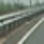
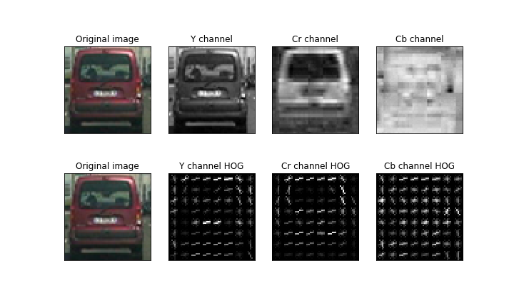

# Writeup

##Vehicle Detection Project

The goals / steps of this project are the following:

* Perform a Histogram of Oriented Gradients (HOG) feature extraction on a labeled training set of images and train a classifier Linear SVM classifier
* Optionally, you can also apply a color transform and append binned color features, as well as histograms of color, to your HOG feature vector. 
* Note: for those first two steps don't forget to normalize your features and randomize a selection for training and testing.
* Implement a sliding-window technique and use your trained classifier to search for vehicles in images.
* Run your pipeline on a video stream (start with the test_video.mp4 and later implement on full project_video.mp4) and create a heat map of recurring detections frame by frame to reject outliers and follow detected vehicles.
* Estimate a bounding box for vehicles detected.

[//]: # (Image References)
[image2]: ./examples/HOG_example.jpg
[image3]: ./examples/sliding_windows.jpg
[image4]: ./examples/sliding_window.jpg
[image5]: ./examples/bboxes_and_heat.png
[image6]: ./examples/labels_map.png
[image7]: ./examples/output_bboxes.png
[video1]: ./project_video.mp4

## [Rubric](https://review.udacity.com/#!/rubrics/513/view) Points

#### Here I will consider the rubric points individually and describe how I addressed each point in my implementation. 

### Video Implementation

#### 1. Provide a link to your final video output.  Your pipeline should perform reasonably well on the entire project video (somewhat wobbly or unstable bounding boxes are ok as long as you are identifying the vehicles most of the time with minimal false positives.)

|  |
|:--:|
| *Project Video* |

A Deep Learning based method (YOLOv3 or SSD) will do much better in terms of accuracy and speed.

### Histogram of Oriented Gradients (HOG)

#### 1. Explain how (and identify where in your code) you extracted HOG features from the training images.

The code for this step is contained in the code cell 5 of the IPython notebook `features.ipynb`.  

Here is an example of one of each of the `vehicle` and `non-vehicle` classes:

|  |  | 
|:--:|:--:| 
| *Vehicle* | *Non-vehicle* |

I then explored different color spaces and different `skimage.hog()` parameters (`orientations`, `pixels_per_cell`, and `cells_per_block`).  I grabbed random images from each of the two classes and displayed them to get a feel for what the `skimage.hog()` output looks like.

Here is an example using the `YCrCb` color space and HOG parameters of `orientations=8`, `pixels_per_cell=(8, 8)` and `cells_per_block=(2, 2)`:

####2. Explain how you settled on your final choice of HOG parameters.

The HOG parameter settings suggested in the course seemed to give reasonable performance. HOG features are expensive to derive, so I stuck with what was recommended in the course.

####3. Describe how (and identify where in your code) you trained a classifier using your selected HOG features (and color features if you used them).

The classifier training code is in `train_classifier.ipynb` notebook. I settled with a reasonably accurate `LinearSVC` classifier. Although it is possible to obtain higher accuracy with `SVC` with `kernel='rbf'`, it is very very slow to process the video. Hence I relied on a simple and faster classifier coupled with robust false positive weeding to process the videos.

The features for the classifier are drawin in `features.ipynb` notebook. The features drawn are `HOG` (all channels), `32x32` spatial and `YCrCb` color histogram (all channels).

I performed `GridSearchCV` 3-fold cross validation to choose the value of penalty parameter `C` among `[.1, .5, 1, 5, 10]`.

Here is the final classifier:

<code>GridSearchCV(cv=3, error_score='raise',  estimator=LinearSVC(C=1.0, class_weight={0: 8792, 1: 8969},  dual=True, fit_intercept=True, intercept_scaling=1, loss='squared_hinge',  max_iter=1000, multi_class='ovr', penalty='l2', random_state=None, tol=0.0001,  verbose=0), fit_params=None, iid=True, n_jobs=1,  param_grid={'C': [0.1, 0.5, 1, 5, 10]}, pre_dispatch='2*n_jobs', refit=True,  return_train_score=True, scoring=None, verbose=0)
</code>

###Sliding Window Search

####1. Describe how (and identify where in your code) you implemented a sliding window search.  How did you decide what scales to search and how much to overlap windows?

I decided to search at 3 different scales `[1, 2, 3]`. Their search areas look like the following:

####2. Show some examples of test images to demonstrate how your pipeline is working.  What did you do to optimize the performance of your classifier?

Ultimately I searched on three scales using YCrCb 3-channel HOG features plus spatially binned color and histograms of color in the feature vector, which provided a nice result.  Here are some example images:

I use a three-fold cross-validation to average the results of my classifier to improve it's performance.

I did a grid search on the penalty term `C` to select the appropriate value.

I tried to limit the window search region to the lower half of the image (and also put restrictions on the x-range for `scale=`) to limit false positives.

I also used `Autti` data set to train my classifier.

 
 
 

### Video Implementation (cntd)

#### 1. Describe how (and identify where in your code) you implemented some kind of filter for false positives and some method for combining overlapping bounding boxes.

I used a fixed length queue `collections.dequeue(maxlen=10)` to collect positive detections for last 10 frames. I add them up and use `scipy.ndimage.measurements.label()` to identify blobs of different cars. A blob, after thresholding needs to be at least `50x50px` to be identified as a car.

Here's an example result showing the heatmap from a series of frames of video, the result of `scipy.ndimage.measurements.label()` and the bounding boxes then overlaid on the last frame of video:

### Here are 10 frames and their corresponding heatmaps and the output after applying `label`:

### Discussion

#### 1. Briefly discuss any problems / issues you faced in your implementation of this project.  Where will your pipeline likely fail?  What could you do to make it more robust?

1.1. `LinearSVC` is not very accurate. Thus it detects a lot of false positives.

1.2. The pipeline in general is slow even with `LinearSVC`, thus inhibiting rapid iteration.

1.3. Pipeline demonstrates good results with `SVC(kernerl='rbf')`, but it is excrutiatingly slow. I could not find a way to fasten it, even on a GPU. Perhaps a vectorized (vs. iterative as it is implemented in my code) version of `skimage.hog()` would greatly help, but I could not find one.

1.4 A deep learning based approach is possibly better suited to solve this approach. It would be far more accurate in identifying cars.

1.5 The classifier has seemed to learnt high color saturation to be highly indicative of presence of a car. As a result, some parts of trees and black tar road were being identified as cars in my pipeline. Again, a deep learning based approach should alleviate this problem. Perhaps including more examples of trees and tar/cemented road in the negative class of the training data may help.